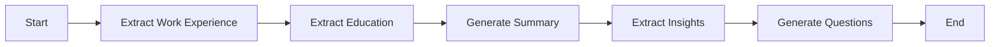

# Resume Analysis Workflow with Langgraph, LangChain and FastAPI

A production-ready LangGraph-powered API system for intelligent resume analysis with real-time streaming and workflow persistence.


## 🚀 Features

### Core Capabilities

* **🔍 Structured Data Extraction** : Extract work experience and education using validated Pydantic models
* **🤖 AI-Powered Analysis** : Generate professional summaries and extract key insights
* **❓ Interview Question Generation** : Create tailored interview questions based on resume content
* **⚡ Real-time Streaming** : Stream analysis results as they're generated
* **💾 Workflow Persistence** : Resume analysis from specific checkpoints
* **🛡️ Error Handling** : Comprehensive error handling and validation
* **🏭 Production Ready** : Logging, health checks, and proper API design

### Technical Highlights

* Server-Sent Events (SSE) for real-time streaming
* SQLite-based checkpoint system for workflow resumption
* Dockerized deployment with health monitoring
* Comprehensive test suite with sample data
* Modular architecture with clear separation of concerns

## 📋 Table of Contents

* [Quick Start](https://claude.ai/chat/829b1b09-9863-4788-b041-3c2adf299afc#-quick-start)
* [API Documentation](https://claude.ai/chat/829b1b09-9863-4788-b041-3c2adf299afc#-api-documentation)
* [Architecture](https://claude.ai/chat/829b1b09-9863-4788-b041-3c2adf299afc#-architecture)
* [Development](https://claude.ai/chat/829b1b09-9863-4788-b041-3c2adf299afc#-development)
* [Deployment](https://claude.ai/chat/829b1b09-9863-4788-b041-3c2adf299afc#-deployment)
* [Testing](https://claude.ai/chat/829b1b09-9863-4788-b041-3c2adf299afc#-testing)
* [Performance](https://claude.ai/chat/829b1b09-9863-4788-b041-3c2adf299afc#-performance)
* [Troubleshooting](https://claude.ai/chat/829b1b09-9863-4788-b041-3c2adf299afc#-troubleshooting)

## 🚀 Quick Start

### Prerequisites

* Python 3.8+
* OpenAI API key
* Git

### 1. Installation

```bash
# Clone the repository
git clone <repository-url>
cd resume-analyzer

# Create virtual environment
python -m venv venv
source venv/bin/activate  # On Windows: venv\Scripts\activate

# Install dependencies
pip install -r requirements.txt
```

### 2. Environment Setup

Create a `.env` file in the project root:

```env
OPENAI_API_KEY=your_openai_api_key_here
LOG_LEVEL=INFO
MAX_WORKERS=1
```

### 3. Run the Application

```bash
# Start the server
uvicorn app.main:app --reload --host 0.0.0.0 --port 8000

# Or use the Makefile
make run
```

The API will be available at `http://localhost:8000`

## 📚 API Documentation

### Interactive Documentation

* **Swagger UI** : `http://localhost:8000/docs`
* **ReDoc** : `http://localhost:8000/redoc`

### Core Endpoints

#### `POST /analyze-resume`

Analyzes a resume and streams results in real-time using Server-Sent Events.

**Request:**

```json
{
  "resume_text": "John Smith\nSenior Software Engineer\nTechCorp Inc. | 2021-01 to Present..."
}
```

**Response:** Server-Sent Events stream with:

* `summary`: Professional resume summary (streamed in chunks)
* `question`: Interview questions as they're generated
* `complete`: Analysis completion with checkpoint ID

#### `POST /resume-questions`

Generate additional questions using a saved checkpoint.

**Request:**

```json
{
  "checkpoint_id": "thread_12345678",
  "insights": [
    "5+ years experience",
    "Leadership skills",
    "Microservices expertise"
  ],
  "summary": "Optional resume summary"
}
```

**Response:**

```json
{
  "questions": [
    "Tell me about your experience leading engineering teams...",
    "How do you approach microservices architecture design?"
  ],
  "checkpoint_id": "thread_12345678",
  "status": "success"
}
```

#### `GET /health`

Health check endpoint for monitoring.

**Response:**

```json
{
  "status": "healthy",
  "timestamp": "2024-01-15T10:30:00Z"
}
```

## 🏗️ Architecture

### Workflow Graph



### Key Components

1. **LangGraph Workflow** : Orchestrates the entire analysis pipeline
2. **Pydantic Models** : Ensure data validation and type safety
3. **Streaming Response** : Real-time results via Server-Sent Events
4. **Checkpoint System** : SQLite-based workflow persistence
5. **Error Handling** : Graceful failure handling at each step

### Node Descriptions

| Node                   | Description                              |
| ---------------------- | ---------------------------------------- |
| `extract_work`       | Extracts structured work experience data |
| `extract_education`  | Extracts structured education data       |
| `generate_summary`   | Creates professional resume summary      |
| `extract_insights`   | Identifies key professional insights     |
| `generate_questions` | Generates tailored interview questions   |

## 💻 Development

### Project Structure

```
resume-analyzer/
├── app/
│   ├── main.py              # FastAPI application
│   ├── models/
│   │   └── resume_models.py # Pydantic models
│   ├── nodes/
│   │   └── workflow_nodes.py # LangGraph nodes
│   ├── workflow/
│   │   └── resume_graph.py  # Workflow definition
│   └── utils/
│       └── config.py        # Configuration
├── test_examples/
│   └── sample_resumes.py    # Test data
├── requirements.txt         # Python dependencies
├── setup.py                # Package configuration
├── run_tests.py            # Test runner script
├── .gitignore              # Git ignore rules
├── .env.example            # Environment template
├── Dockerfile              # Docker image definition
├── docker-compose.yml      # Container orchestration
├── Makefile               # Development commands
└── README.md              # Project documentation
```

### Development Commands

```bash
# Install dependencies
make install

# Run development server
make run

# Run tests
make test

# Clean up generated files
make clean

# Docker operations
make docker-build    # Build Docker image
make docker-run      # Start with docker-compose
make docker-stop     # Stop containers

# Full setup for new users
make setup          # Copy .env.example to .env
```

### Package Configuration

The project includes `setup.py` for package management:

```python
# Install as editable package for development
pip install -e .

# Build distribution packages
python setup.py sdist bdist_wheel

# Install from source
pip install .
```

### Git Configuration

The `.gitignore` file excludes:

* **Python artifacts** : `__pycache__/`, `*.pyc`, `*.pyo`
* **Virtual environments** : `venv/`, `env/`, `.env`
* **Database files** : `*.db`, `*.sqlite`, `checkpoints.db`
* **IDE files** : `.vscode/`, `.idea/`, `*.swp`
* **OS files** : `.DS_Store`, `Thumbs.db`
* **Logs** : `*.log`, `logs/`
* **Distribution** : `build/`, `dist/`, `*.egg-info/`

## 📋 Project Files Overview

### Core Application Files

| File                             | Purpose          | Description                                    |
| -------------------------------- | ---------------- | ---------------------------------------------- |
| `app/main.py`                  | FastAPI App      | Main application with endpoints and middleware |
| `app/models/resume_models.py`  | Data Models      | Pydantic models for validation                 |
| `app/nodes/workflow_nodes.py`  | Workflow Logic   | LangGraph node implementations                 |
| `app/workflow/resume_graph.py` | Graph Definition | Workflow orchestration setup                   |

### Configuration Files

| File                 | Purpose              | Description                             |
| -------------------- | -------------------- | --------------------------------------- |
| `requirements.txt` | Dependencies         | Python package requirements             |
| `setup.py`         | Package Config       | Package metadata and installation setup |
| `.env.example`     | Environment Template | Example environment configuration       |
| `.gitignore`       | Git Rules            | Files and directories to ignore in Git  |
| `Makefile`         | Build Commands       | Development and deployment commands     |

### Docker & Deployment

| File                   | Purpose         | Description                      |
| ---------------------- | --------------- | -------------------------------- |
| `Dockerfile`         | Container Image | Docker image build instructions  |
| `docker-compose.yml` | Orchestration   | Multi-container deployment setup |

### Testing & Examples

| File                                | Purpose     | Description                      |
| ----------------------------------- | ----------- | -------------------------------- |
| `run_tests.py`                    | Test Runner | Comprehensive API testing script |
| `test_examples/sample_resumes.py` | Test Data   | Sample resume data for testing   |

### Data Models

The system uses structured Pydantic models for data validation:

```python
class WorkExperience(BaseModel):
    company: str
    position: str
    start_date: str
    end_date: Optional[str]
    description: str

class Education(BaseModel):
    institution: str
    degree: str
    field_of_study: str
    graduation_date: str
```

## 🚢 Deployment

### Docker Deployment

```bash
# Build and run with Docker Compose
make docker-build
make docker-run

# Or manually
docker build -t resume-analyzer .
docker run -p 8000:8000 --env-file .env resume-analyzer
```

### Environment Variables

| Variable           | Description               | Default  |
| ------------------ | ------------------------- | -------- |
| `OPENAI_API_KEY` | OpenAI API key (required) | -        |
| `LOG_LEVEL`      | Logging level             | `INFO` |
| `MAX_WORKERS`    | Maximum worker processes  | `1`    |

### Production Considerations

* Use a reverse proxy (nginx) for SSL termination
* Set up proper logging and monitoring
* Configure rate limiting
* Use environment-specific configuration
* Set up database backups for checkpoints

## 🧪 Testing

### Running Tests

```bash
# Run the comprehensive test suite
python run_tests.py

# Or use make
make test

# Run individual test functions
python -c "
from run_tests import test_health, test_analyze_resume
test_health()
test_analyze_resume()
"
```

### Test Script Features

The `run_tests.py` script provides comprehensive testing:

* **Health Check Testing** : Validates API availability and response
* **Resume Analysis Testing** : Tests streaming analysis with sample data
* **Checkpoint Resumption** : Verifies workflow persistence functionality
* **Error Handling** : Tests various error scenarios
* **Connection Validation** : Ensures API connectivity

### Test Output Example

```bash
$ python run_tests.py

Starting Resume Analysis API Tests
==================================================
Testing health endpoint...
Health Status: 200
Response: {'status': 'healthy', 'timestamp': '2024-01-15T10:30:00Z'}
--------------------------------------------------
Testing resume analysis...
Status Code: 200
Received: summary - Senior Software Engineer with 5+ years of experience...
Received: question - Tell me about your experience leading engineering teams...
Received: complete - Analysis completed successfully
Checkpoint ID: thread_abc123def456
--------------------------------------------------
Testing checkpoint resumption...
Status Code: 200
Generated 5 questions:
1. Tell me about your experience leading engineering teams...
2. How do you approach microservices architecture design?
3. What strategies do you use for scaling systems to handle 10M+ users?
--------------------------------------------------
All tests completed!
```

### Test Examples

The project includes comprehensive test examples:

```bash
# Test resume analysis
curl -X POST "http://localhost:8000/analyze-resume" \
  -H "Content-Type: application/json" \
  -d '{
    "resume_text": "John Smith\nSenior Software Engineer\nTechCorp Inc..."
  }'

# Test checkpoint resumption
curl -X POST "http://localhost:8000/resume-questions" \
  -H "Content-Type: application/json" \
  -d '{
    "checkpoint_id": "thread_12345678",
    "insights": ["5+ years experience", "Leadership skills"]
  }'

# Health check
curl http://localhost:8000/health
```

### Sample Data

Test with included sample resumes:

```python
from test_examples.sample_resumes import SAMPLE_RESUME_1, SAMPLE_RESUME_2
```

## ⚡ Performance

### Optimization Features

* **Streaming** : Reduces perceived latency by showing results as they're generated
* **Checkpointing** : Allows efficient resumption without recomputation
* **Async Processing** : Non-blocking request handling
* **Connection Pooling** : Efficient database connections

### Monitoring

The application includes comprehensive monitoring:

* **Logging** : Structured logging throughout the pipeline
* **Health Checks** : `/health` endpoint for load balancer integration
* **Error Tracking** : Detailed error messages and stack traces
* **Performance Metrics** : Response time and throughput tracking

### Scaling Considerations

* Consider adding Redis for caching frequently accessed data
* Implement rate limiting for production use
* Use connection pooling for database operations
* Monitor memory usage with large resume texts

## 🐛 Troubleshooting

### Common Issues

| Issue                          | Solution                                              |
| ------------------------------ | ----------------------------------------------------- |
| **OpenAI API Key Error** | Ensure `OPENAI_API_KEY`is set correctly in `.env` |
| **Database Permissions** | Ensure write permissions for `checkpoints.db`       |
| **Memory Usage**         | Monitor memory usage with large resume texts          |
| **Timeout Issues**       | Adjust timeout settings for slow LLM responses        |

### Debug Mode

Enable detailed logging:

```bash
LOG_LEVEL=DEBUG uvicorn app.main:app --reload
```

### Error Types

The system handles various error types:

* **Validation Errors** : Pydantic model validation with detailed messages
* **LLM Errors** : Graceful handling of API failures with fallbacks
* **Checkpoint Errors** : Clear error messages for invalid checkpoint IDs
* **Stream Errors** : Error events sent via the streaming interface

## 🔒 Security

### Security Features

* **API Key Management** : Secure storage of OpenAI API keys
* **Input Validation** : All inputs validated via Pydantic models
* **Error Sanitization** : Error messages don't expose internal details
* **CORS Configuration** : Properly configured for your frontend

### Best Practices

* Store API keys in environment variables, never in code
* Use HTTPS in production
* Implement proper authentication and authorization
* Regular security updates for dependencies

## 🚀 Extensions

### Potential Enhancements

* **Multiple LLM Support** : Add support for other LLM providers (Anthropic, Google, etc.)
* **Resume Scoring** : Add quantitative resume scoring algorithms
* **Batch Processing** : Process multiple resumes simultaneously
* **Export Features** : Export results to PDF or Word formats
* **ATS Integration** : Webhook support for Applicant Tracking Systems
* **Analytics Dashboard** : Web interface for analyzing trends
* **Multi-language Support** : Support for resumes in different languages

### Contributing

1. Fork the repository
2. Create a feature branch (`git checkout -b feature/amazing-feature`)
3. Add tests for new functionality
4. Commit your changes (`git commit -m 'Add amazing feature'`)
5. Push to the branch (`git push origin feature/amazing-feature`)
6. Open a Pull Request

## 📄 License

This project is licensed under the MIT License - see the [LICENSE](https://claude.ai/chat/LICENSE) file for details.

## 📞 Support

For issues and questions:

* 🐛  **Bug Reports** : [Create an issue](https://github.com/your-username/resume-analyzer/issues)
* 💬  **Discussions** : [GitHub Discussions](https://github.com/your-username/resume-analyzer/discussions)
* 📖  **Documentation** : Check the troubleshooting section above
* 🔍  **Logs** : Review application logs for detailed error information

## 🙏 Acknowledgments

* [LangGraph](https://github.com/langchain-ai/langgraph) for the workflow orchestration
* [FastAPI](https://fastapi.tiangolo.com/) for the excellent API framework
* [OpenAI](https://openai.com/) for the language model capabilities

---

**Made with ❤️ by Pathan Afnan Khan**
